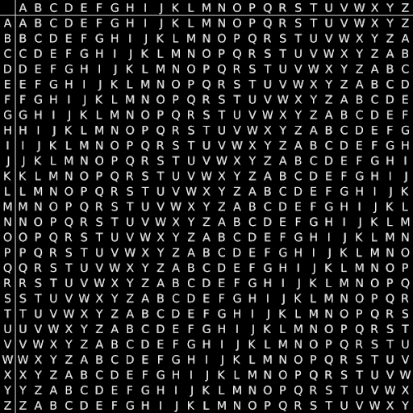

# Introduction to cryptography - the Vigenère cipher
In [my first cryptography blogpost](https://github.com/yo-yo-yo-jbo/crypto_terminology/) I introduced some definitions and concepts, one of them was the concept of `substitution ciphers`. In short, those ciphers substitute plaintext tokens by some methodology that depends on the cipher's `key`. I did forget to mention - encryption and decryption methodologies might be slightly different but the key would be used for both encryption and decryption - those ciphers are known as `symmetric ciphers`.  
We've seen examples of `monoalphabetic substitution ciphers` - those are ciphers that substitute *one letter* each time. We've also seen how one can use `frequency analysis` to break the cipher.  

In this blogpost, I'd like to show an example of a non-monoalphabetic substitution cipher, explain why naive frequency analysis fails on it and how one might still attempt to break the cipher.  
Armed with the knowledge of modular arithmetics from [my previous blogpost](https://github.com/yo-yo-yo-jbo/crypto_modular/), this should be a breeze!

## Motivation
We've seen that monoalphabetic ciphers are vulnerable to frequqncy analysis since the same letter in plaintext is encrypted to the letter in ciphertext.  
You could create a naive yet more complex substitution ciphers - for example, having each two letters mapped to other two letters. Those are called `digraphs` and a well-known example of a digraph is the [Playfair Cipher](https://en.wikipedia.org/wiki/Playfair_cipher). The security of such ciphers is much better than monoalphabetic substitution ciphers, but it's still vulnerable to some frequency analysis (e.g. `th` in English is way more common than `zx`). There are other, more sophisticated techniques to crack Playfair - I won't discuss them here.  
The big advantage of `Playfair` (and other `digraph ciphers`) is that the distribution in the ciphertext is much more uniform, so more text is required for a serious frequency analysis. You could go beyond that (do something similar for 3-letters, 4-letters and so on) but similar claims could be made - sufficient ciphertext enables frequency analysis.  

## The cipher
The Vigenère cipher does something novel - instead of encrypting by a constant `n-gram` (3-letters etc.) it encrypts each letter with a letter from a different alphabet, derived by the encryption key. We could therefore classify that cipher as a `polyalphabetic substitution cipher` with a frequency that depends on the key length - which makes naive frequency analysis impractical.  
Let's see an example. For that we will be using a `Tabula Recta` (also known as a `Vigenère square`, which is pretty self-explanatory:


The idea is simple - let's say the first letter we'd like to encrypt is `D` and the first letter of the key is `Q`. We look at the Tabula Recta and see that for column `D` and row `Q` we get a `T`, so we add `T` to our ciphertext. The same idea goes on and on (e.g. 2nd plaintext letter is encrypted using table with the 2nd key letter as the row). Of course, the key might be way shorter than the plaintext, so we simply use the key in a cyclic fashion.  
We can use modular arithmetic to simplify:

```python
import string

def encrypt(plaintext, key):
    """
        Encrypts the plaintext (discarding any non-uppercase English letters).
        This assumes the key is already all uppercase English letters.
    """

    uppers = [ c for c in plaintext if c in string.ascii_uppercase ]
    return ''.join([ chr(ord('A') + ((ord(uppers[i]) - ord('A') + ord(key[i % len(key)]) - ord('A')) % 26)) for i in range(len(uppers)) ])
```

Note how simple the cipher is! The line that defines the `uppers` variable simply discards of all non-uppercase characters, but the essence of the algorithm lies within the `return` clause:
1. We iterate the indices of the plaintext (`uppers` after filtering), each index is called `i`.
2. We take the letter's index (e.g. `A` is `0`, `B` is `1` and so on) by substructing `ord('A')` from the plaintext letter, and add it to the `key`'s current letter index.
3. Key is used cyclically so we use `key[i % len(key)]`.
4. Since the addition from bullet (2) can exceed `25`, we use ` % 26` and then simply add `ord('A')` to it to make it a letter again.

If you read this algorithm carefully you'd discover something interesting - this is exactly the `Caesar cipher` used for each key letter seperately!  
For example, if the key length is 4, then the 1st, 5th, 9th (etc.) letters in the plaintext are going to simply be shifted by the same offset!  
This is exactly the strength and weakness of the Vigenère cipher - simple frequency analysis fails (as the mapping strongly depends on the key length)... But it's trivial if we know the key length!

## Breaking the cipher
Statistical analysis on a ciphertext can reveal the key length, and once the key's length is known, frequency analysis can be applied.  
One useful tool for dealing with `polyalphabetic ciphers` is known as the [Kasiski examination](https://en.wikipedia.org/wiki/Kasiski_examination).  
The idea, in essence, is quite simple - if we find repeating occurrences in the ciphertext (at least 3 characters to be useful), then the distance between those occurrences is likely to be a multiple of the key length. If we find multiple repeating candidates we could take the greatest common divisors of all those distances.  
Let's take the following ciphertext as an example:
```
MNBBMIJHBQGBBHEMZVFTBLFCAMGMLYWAIJMVQPNXJVKMSQNNOJVSKFQSGMIMFVCYPHBJVUKWYEFKFRVTZTAPSJVSKFQSGMIEXMSDBNVPXSFDQRVVLHSFBWIQAYLWRFQAYTFPADSNUGLNHQHIUNLWZVLAFQECQJGWIGKCUWQSYROZDFBJGZGCNRNQSINXFFAXMFPGHYNEUQSHLASQYRATJLASTAPSJVVBRKOHMAIJPCZDRZBLSMAMDRPNQLBQWWUIYJGKQQSFPFTWWVUMJPFXETMTAIMRSDWSPHVUNEETVMCXMWIFMSDMLETVDWAUNRQXEOHFXDGPFXTXUUNFENXZLQTOBTNQKFODTRZYLSGAASGWKXZXCFHRZPMVLHTIFKWEHMVQYGMFGZNGNOEMXQWWOYNHVIIJTQTIRDJVLASKRRIQPSEWWEVUNRBNBUOEPNKZHFTITPXGZHCXIIMQMKMSZEQBTXWTQTEEAJBHEOUNSWWXZXTUFGMJRLAHUMRPTALHFQDHKJEXKOOTVWSMMGRQRFBFRVBHZOZAXQAMVUDVLSXKACIMLETVCBRUDVBNRERVQAQLFQFDWPPEWGETEMOOCQJHAMHTELZJEDEOXIXMNQSWSMDVAHSNXFKTBLFCAYCGNQIHSEIIFEEEFMLTGQCBVIXZBGUSPWTPAMRAEFEMELBKMNGQYXGBTUTZIPIKTAUSGIPIAMGNEPIZWWBGORREJHAMIBNBBGIUTIEEVBISWLBFLVSJQWHFRERTXXZKSMTRVJHTRAQOEBMMFDGUMNAREJMOESBZISWLBFLVSJXWTQTIAOFRVLVAUYLSXTXVQRRLFQFDWPAYTMIVHSEIFXQEQZOYEFBMIQKSMLYIQMCXOZDGPJRAMVMPCMSIVTRAOEWUIFXRFONETVDWFGSUQSKLAFAUTPYLWIVANRTNRWEWWEUMWSAGHTRBCLLSGOPDVKYWNXWZSNVJPWVHDOAQHTMEGQIFAJRLHIFAEMKYYXTDOZBMIVTMFOQIDMFVCYPRBJRUBSEIFATYYAHMBBIWHALTAUALYLALWEIGBMMKBGIHRZJMTXZANTQPRGPSHEEGTRWASDERDJRAYWHEAMAIJFSFTUMRRWOSDTNTPIVMCFHRUREQGSHEEPJEJYFAMGPJQSZOUNVSSSORCGAYTIEEGYUDGGNRYNDFHRXMSFXZUNRILEAGHTELZJEDEOXIXMDSMUSFYBCWEKLKQRRIQPSEWWEJMAITXSZSCWTRXXRNAOGKSGWOFSPPTSDPVQNJMMYFZSDEQNTVKMSMKGPJFAMGAFZMFXLAOFYBCIMVESFSYQUXZKCGGUEJVWIFQCUMBIVTBPTNAYIDXGEWRDJFWXBPOZQSELXRNYFIIMKMGARVOSSJXRNYGPJEHTHTEGQHXZXTQWGPFXZTREOZMYLAGUFOGMFGZYCGNQCXAAEZUNTXZTAEGNUGBMSKXTQWNZJPADSPRBXXSXPOFEEQSXZXRQSRZYXZBGUSBCWAGKZPNBEYLWPCDLQWKXZXSXEPBWSFTBPTUMXAAMQTTUMGISNHKOSBMITTIPWRUFOWNGQOSIXIJOWOENTWISWMQXVAYMFZKUTUWZXHTMUNTNTVOAOFCBCQHTXRURGKMISIWRIGEFWFMFGNOGUVGYWFERZNRYZZGTGWSWSGRKOHKFPDNGORVUNRSEGIERFUPGKSMNQGTYUTZXUFKWMEBBMLFEJWWXYMFGMWOFHKXEQOJEFWMAUPIQPMLQDIZQSEDLKQEKQXXOBHTOHBXOAGQALBZBMLACGTAIYMGGOXIGGBMLACGTEMQMYBCGSOQFWSGRKOHKFPDNGORVUNRSEGKOHJZMDWOFOZQHFGFPEYBCBEYXKMRFGTYENFPEEKMISMOZDYQJXGNGMNQBWCLHAMKRCXFWEWQVRQYWXHFAUEWBRYHCPYRBBIJXHTEPZNQAGOXSLMXMSFOORVUNRSEAKCEQRIALHTAGWKGMKWASVBDQQVFUMRQXXZTHAFWCIKAGUBEBXQITRKTAGBMIQLOKAALYLAGYZOGEMELMVQYYWTODBYQMLKWMEXWETUIYSXHIFSZIWXAGUKOHATQWMVUNTBMELRCGWVTQRWOSDFBZLMNXAQFBZNEETVMCXMWEFWHTIFQXQQFOZISMXXGRCGMNGXXGIHTIFQSHAOWPUNTGYLRCGCNVYWLHDGSNTQEXMSDAYTBIJXOXLNTNOW
```

Let us find some repeating characters in the ciphertext! Here's a very naive way of doing that for length 7 (I just picked 7 but normally you'd start at 3):
```python
repeats = [ ciphertext[i:i+7] for i in range(0, len(ciphertext) - 7) if ciphertext.count(ciphertext[i:i+7]) > 1 ]
```

We can now examine the distances and take their `gcd` (greatest common divisor):

```python
repeats = [ ciphertext[i:i+7] for i in range(0, len(ciphertext) - 7) if ciphertext.count(ciphertext[i:i+7]) > 1 ]
distances = [ len(ciphertext.split(entry)[1])+7 for entry in repeats ]
import math
candidate = math.gcd(*distances)
```

This sets `candidate` to be 9, so we strongly believe the length of the key is 9.  
Assuming the key length is 9, we then divide the ciphertext to 9 chunks and perform frequency analysis on each one. I won't go through the trouble of that analysis (I've done so in [my first cryptography blogpost](https://github.com/yo-yo-yo-jbo/crypto_terminology/)) - but the result should look like this:

```
ANOTHERONEGOTCAUGHTTODAYITSALLOVERTHEPAPERSTEENAGERARRESTEDINCOMPUTERCRIMESCANDALHACKERARRESTEDAFTERBANKTAMPERINGDAMNKIDSTHEYREALLALIKEBUTDIDYOUINYOURTHREEPIECEPSYCHOLOGYANDSTECHNOBRAINEVERTAKEALOOKBEHINDTHEEYESOFTHEHACKERDIDYOUEVERWONDERWHATMADEHIMTICKWHATFORCESSHAPEDHIMWHATMAYHAVEMOLDEDHIMIAMAHACKERENTERMYWORLDMINEISAWORLDTHATBEGINSWITHSCHOOLIMSMARTERTHANMOSTOFTHEOTHERKIDSTHISCRAPTHEYTEACHUSBORESMEDAMNUNDERACHIEVERTHEYREALLALIKEIMINJUNIORHIGHORHIGHSCHOOLIVELISTENEDTOTEACHERSEXPLAINFORTHEFIFTEENTHTIMEHOWTOREDUCEAFRACTIONIUNDERSTANDITNOMSSMITHIDIDNTSHOWMYWORKIDIDITINMYHEADDAMNKIDPROBABLYCOPIEDITTHEYREALLALIKEIMADEADISCOVERYTODAYIFOUNDACOMPUTERWAITASECONDTHISISCOOLITDOESWHATIWANTITTOIFITMAKESAMISTAKEITSBECAUSEISCREWEDITUPNOTBECAUSEITDOESNTLIKEMEORFEELSTHREATENEDBYMEORTHINKSIMASMARTASSORDOESNTLIKETEACHINGANDSHOULDNTBEHEREDAMNKIDALLHEDOESISPLAYGAMESTHEYREALLALIKEANDTHENITHAPPENEDADOOROPENEDTOAWORLDRUSHINGTHROUGHTHEPHONELINELIKEHEROINTHROUGHANADDICTSVEINSANELECTRONICPULSEISSENTOUTAREFUGEFROMTHEDAYTODAYINCOMPETENCIESISSOUGHTABOARDISFOUNDTHISISITTHISISWHEREIBELONGIKNOWEVERYONEHEREEVENIFIVENEVERMETTHEMNEVERTALKEDTOTHEMMAYNEVERHEARFROMTHEMAGAINIKNOWYOUALLDAMNKIDTYINGUPTHEPHONELINEAGAINTHEYREALLALIKEYOUBETYOURASSWEREALLALIKEWEVEBEENSPOONFEDBABYFOODATSCHOOLWHENWEHUNGEREDFORSTEAKTHEBITSOFMEATTHATYOUDIDLETSLIPTHROUGHWEREPRECHEWEDANDTASTELESSWEVEBEENDOMINATEDBYSADISTSORIGNOREDBYTHEAPATHETICTHEFEWTHATHADSOMETHINGTOTEACHFOUNDUSWILLINGPUPILSBUTTHOSEFEWARELIKEDROPSOFWATERINTHEDESERTTHISISOURWORLDNOWTHEWORLDOFTHEELECTRONANDTHESWITCHTHEBEAUTYOFTHEBAUDWEMAKEUSEOFASERVICEALREADYEXISTINGWITHOUTPAYINGFORWHATCOULDBEDIRTCHEAPIFITWASNTRUNBYPROFITEERINGGLUTTONSANDYOUCALLUSCRIMINALSWEEXPLOREANDYOUCALLUSCRIMINALSWESEEKAFTERKNOWLEDGEANDYOUCALLUSCRIMINALSWEEXISTWITHOUTSKINCOLORWITHOUTNATIONALITYWITHOUTRELIGIOUSBIASANDYOUCALLUSCRIMINALSYOUBUILDATOMICBOMBSYOUWAGEWARSYOUMURDERCHEATANDLIETOUSANDTRYTOMAKEUSBELIEVEITSFOROUROWNGOODYETWERETHECRIMINALSYESIAMACRIMINALMYCRIMEISTHATOFCURIOSITYMYCRIMEISTHATOFJUDGINGPEOPLEBYWHATTHEYSAYANDTHINKNOTWHATTHEYLOOKLIKEMYCRIMEISTHATOFOUTSMARTINGYOUSOMETHINGTHATYOUWILLNEVERFORGIVEMEFORIAMAHACKERANDTHISISMYMANIFESTOYOUMAYSTOPTHISINDIVIDUALBUTYOUCANTSTOPUSALLAFTERALLWEREALLALIKE
```

This is the well known [Hacker's Manifesto](http://phrack.org/issues/7/3.html)!

## Summary
This blogpost introduced us to some new concepts, we've seen how Polyalphabetic ciphers make naive frequency analysis challenging, but are still vulnerable to statistical analysis.  
In the next couple of blogposts on cryptography I intend to start discussing more modern cryptography - the Vigenère is by no means modern.  
Nevertheless I still think there is merit in discussing those concepts in terms of "way of thinking" about advantages and disadvantages of ciphers.

Stay tuned,
Jonathan Bar Or
